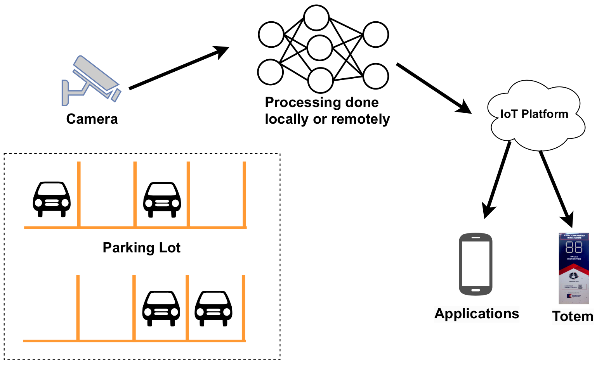
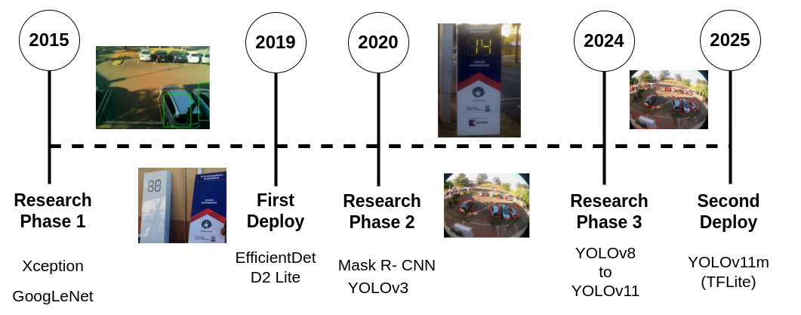
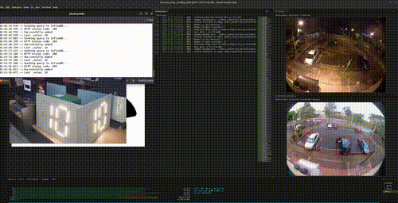

# 🚗 Smart Parking System with Deep Learning at Unicamp

This repository contains the complete implementation of a **real-time smart parking monitoring system** using **edge computing and deep learning**, representing a **decade of research** at [Unicamp](https://www.unicamp.br/).  

The system evolved through multiple research phases, culminating in real-world deployments optimized for **accuracy**, **inference speed**, and **low-power edge devices**.

---

## 📑 Table of Contents
- [Overview](#overview)
- [Architecture](#architecture)
- [Project Timeline](#project-timeline)
- [Demonstration](#demonstration)
- [Hardware Setup](#hardware-setup)
- [Software Implementation](#software-implementation)
- [Features](#features)
- [Collaborators](#collaborators)
- [How to Cite](#how-to-cite)
- [License](#license)

---

## Overview

This system uses **deep learning-based object detection** to identify free and occupied parking spots in real-time. The design supports deployment on low-power devices such as **Raspberry Pi**, leveraging **TensorFlow Lite** optimizations for on-device inference.  

It has undergone **four major research phases** since 2015, progressively improving detection accuracy, inference speed, and robustness under real-world conditions.

---

## Architecture
  

---

## Project Timeline

  

### 🚀 2025 – Second Deployment
- Deployed **YOLOv11m** optimized with TensorFlow Lite.
- Achieved best trade-off between accuracy and inference speed for edge computing.
- Results published in:
  - **[10 Years of Deep Learning for Vehicle Detection at a Smart Parking: What has Changed?](https://sol.sbc.org.br/index.php/courb/article/view/35256)** (CoUrb 2025) and received honorable mention as one of the best papers.

### 🔍 2024 – Research Phase 3
- Benchmark study on **YOLOv8–YOLOv11**.
- Multi-device performance evaluation.
- Results published at the arxiv paper submitted to Elsevier Internet of Things:
  - **[Smart Parking with Pixel-Wise ROI Selection for Vehicle Detection Using YOLOv8, YOLOv9, YOLOv10, and YOLOv11](https://arxiv.org/abs/2412.01983)**.

### 🔍 2020–2024 – Research Phase 2
- Evaluation of **YOLOv3** and **Mask R-CNN**.
- Focused on balancing accuracy and speed for real-time use.
- Results published in:
  - **[SmartParking – A smart solution using Deep Learning](https://smartcampus.prefeitura.unicamp.br/pub/artigos_relatorios/PFG_Joao_Victor_Estacionamento_Inteligente.pdf)**.

### 🚀 2019 – First Deployment
- Deployed **SSD-based EfficientDet d2** with TensorFlow Lite.
- Featured in the media:
  - [Inova Campinas 2019 video](https://youtu.be/_cFjeLJ9SOI?t=105).

### 🔍 2015–2019 – Research Phase 1
- Explored **GoogleLeNet** and **Xception** for CNN-based parking detection.
- Presented at **[PAPIs.io LATAM 2018](https://www.youtube.com/watch?v=vRXgc0Bvbx8)**.

---

## Demonstration
  

🎥 [Full demonstration video](https://youtu.be/7rofjEfX5fA)

---

## Hardware Setup
Full details: [📖 Hardware Documentation](hardware/)  

Key components:
- [Parking totem assembly](hardware/totem/)
- [Raspberry Pi 3B+ configuration](hardware/pi_and_camera/)

---

## Software Implementation
Full details: [📖 Software Documentation](software/)  

Key modules:
- [Benchmarking deep learning models](software/)
- [InfluxDB setup and monitoring](software/influx/)

---

## Features
- **Real-time detection** of parking spot occupancy.
- **Edge-optimized inference** using TensorFlow Lite.
- **Multiple model support** (YOLO, EfficientDet, Mask R-CNN).
- **Historical data logging** with InfluxDB.
- Modular hardware and software documentation.

---

## Collaborators

**Present:**
- [Juliana Freitag Borin](http://lattes.cnpq.br/4534936707754253)
- [Luis Fernando Gomez Gonzalez](http://lattes.cnpq.br/4910241356954777)
- [Gustavo P. C. P. da Luz](http://lattes.cnpq.br/3340329193414132)
- [Gabriel Massuyoshi Sato](http://lattes.cnpq.br/7245309149482723)
- [Tiago Godoi Bannwart](http://lattes.cnpq.br/4897522676378277)


**Past:**
- [Darlinne H. P. Soto](http://lattes.cnpq.br/9411807355500538)
- [Matheus de S. Oliveira](m203407@dac.unicamp.br)
- [Alonso M. P. Huachaca](http://lattes.cnpq.br/8095974767817734)
- [Alexandre Junqueira](https://www.linkedin.com/in/alexandre-junqueira/)
- [J. V. Baggio](j170710@dac.unicamp.br)

---

## How to Cite

```bibtex
@article{da2024smart,
  title={Smart Parking with Pixel-Wise ROI Selection for Vehicle Detection Using YOLOv8, YOLOv9, YOLOv10, and YOLOv11},
  author={da Luz, Gustavo PCP and Sato, Gabriel Massuyoshi and Gonzalez, Luis Fernando Gomez and Borin, Juliana Freitag},
  journal={arXiv preprint arXiv:2412.01983},
  year={2024},
  doi= {10.48550/arXiv.2412.01983}
}

@inproceedings{da202510,
  author = {Gustavo da Luz and Gabriel Sato and Tiago Bannwart and Luis Gonzalez and Juliana Borin},
  title = {10 Years of Deep Learning for Vehicle Detection at a Smart Parking : What has Changed?},
  booktitle = {Anais do IX Workshop de Computação Urbana},
  location = {Natal/RN},
  year = {2025},
  pages = {127--140},
  publisher = {SBC},
  address = {Porto Alegre, RS, Brasil},
  doi = {10.5753/courb.2025.8869},
  url = {https://sol.sbc.org.br/index.php/courb/article/view/35256}
}
```

---

## License
This project is licensed under the [MIT License](LICENSE).
